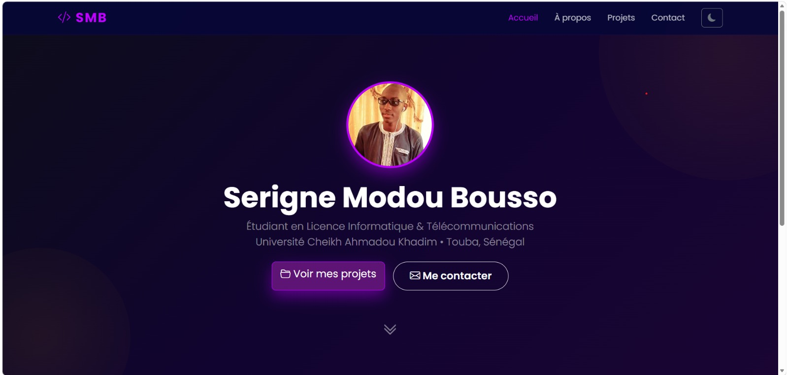
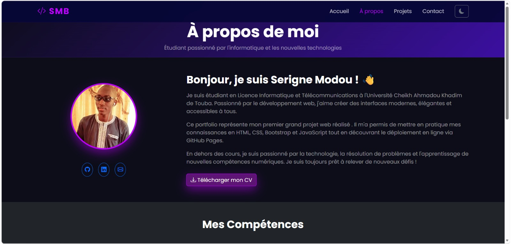

# Portfolio Personnel - Serigne Modou Bousso
## Présentation du projet 
Dans le cadre du module de développement web front-end, nous avons réalisé un portfolio personnel conçu pour être consulté par des recruteurs, enseignants ou entreprises souhaitant découvrir le profil et les réalisations de l'étudiant. 

## Sujet choisi
Sujet B — Portfolio personnel d'étudiant

## Technologies utilisées
Le projet a été développé en utilisant exclusivement les technologies suivantes : 
•	HTML5 — pour la structure sémantique des pages 
•	CSS3 — pour la personnalisation visuelle 
•	Bootstrap 5 — pour la grille responsive et les composants 
•	JavaScript Vanilla — pour les interactions dynamiques 
•	Bootstrap Icons — pour l'iconographie 

## Site en ligne
https://boussobaly098.github.io/mon-projet/

## Fonctionnalités
Afin de respecter les exigences JavaScript du projet, plusieurs fonctionnalités interactives ont été intégrées : 
Validation du formulaire de contact 
Vérification des champs obligatoires et du format de l'adresse email. 
Filtrage dynamique des projets 
Permet d'afficher les projets selon leur catégorie (Web, Design, etc.). 
Animations au scroll 
Les sections apparaissent progressivement lors du défilement de la page grâce à l'API IntersectionObserver. 
Effet dynamique sur la barre de navigation 
Ajout d'une ombre à la navbar lors du scroll pour améliorer l'expérience utilisateur.

## Captures d'écran

## Équipe
- Serigne Modou Bousso
- Sokhna Maty Diakhaté
- Sokhna Mai Sylla

## Remerciements
Projet réalisé dans le cadre du module Développement Web Front-End.
